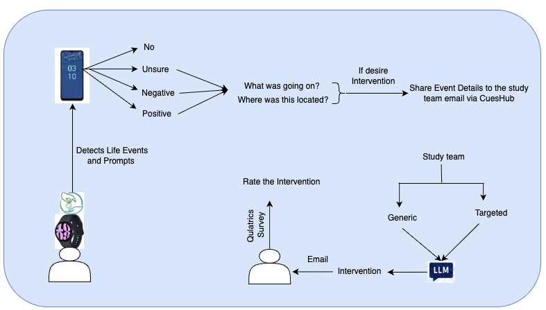

# **RELIEF Study System: Automating Stress Intervention Delivery**  

## **📌 Overview**  
This repository contains the **end-to-end automated system** designed for the **RELIEF Study**, a research initiative integrating **wearable AI and LLM-driven interventions** for stress management. The system streamlines **data collection, processing, intervention generation, and feedback delivery** in real-time, minimizing manual intervention and ensuring consistent execution throughout the study.  

---

## **⚙️ System Architecture**  

### **1️⃣ Data Collection & Processing**  
✅ **Smartwatch & Manual Logging**  
- Participants using the **CuesHub smartwatch** log **daily stressors**, including **stressor descriptions and locations**.  
- Non-smartwatch participants report stressors through **randomized prompts** sent via email.  
- Weekly memory logs and stressor descriptions are extracted from **images shared via email**.  

✅ **Automated Data Pipeline**  
- Emails are **processed automatically** to extract stressor details.  
- Stressor logs are stored in a **structured database** for real-time access.  

---

### **2️⃣ LLM-Generated Personalized Interventions**  
✅ **Context-Aware Intervention Generation**  
- Stressor data is used to create **context-aware prompts** for the **LLM** (e.g., GPT-4o, LLaMA3).  
- The LLM generates **personalized stress interventions** based on:  
  - **Stressor description & location**.  
  - **Health & behavioral assessments**.  

✅ **Automated Email Delivery**  
- Interventions are automatically sent to participants via **email**.  
- A **Qualtrics survey link** is included for participant feedback.  

---

### **3️⃣ Survey Processing & Real-Time Feedback**  
✅ **Weekly Surveys (Qualtrics Integration)**  
- Participants assess interventions based on **relevance, usefulness, and impact**.  
- Additional surveys track **behavioral changes, personality traits (BFI-10), stress levels (PSS-4), and health outcomes (fatigue, sleep quality, pain)**.  

✅ **Automated Data Processing & Visualization**  
- Survey responses are processed **immediately** after submission.  
- A **personalized stressor summary** is generated and sent back to participants within **hours**.  
- Data is stored for **further analysis** to compare tailored vs. generic interventions.  

---

### **4️⃣ Real-Time System Execution**  
✅ **Fully Automated Workflow**  
- The system runs in a **serverless cloud environment**, ensuring **24/7 execution**.  
- Supports **Android & iPhone users**.  
- **Biometric-triggered prompts** are enabled for smartwatch users.  

✅ **Cross-Platform Compatibility**  
- Secure database stores **all processed stressor data, interventions, and user feedback**.  
- The system integrates with **APIs for email automation, LLM inference, and survey data retrieval**.  

---

## **🚀 Key Features & Impact**  
🔹 **Fully automated data collection & processing**—eliminates manual logging.  
🔹 **LLM-powered personalized stress interventions**—generated dynamically based on user history.  
🔹 **Real-time email delivery & participant feedback loop**—ensures immediate insights.  
🔹 **Scalable architecture**—supports both smartwatch & non-smartwatch users.  
🔹 **Enables large-scale stress management research**—contributes to AI-driven behavioral health solutions.  

---

🚀 **This system bridges AI, wearable technology, and behavioral science to transform stress management research!**  